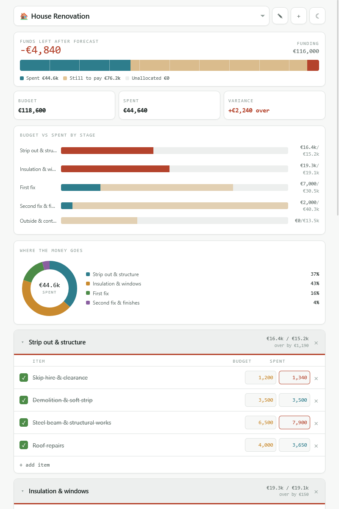
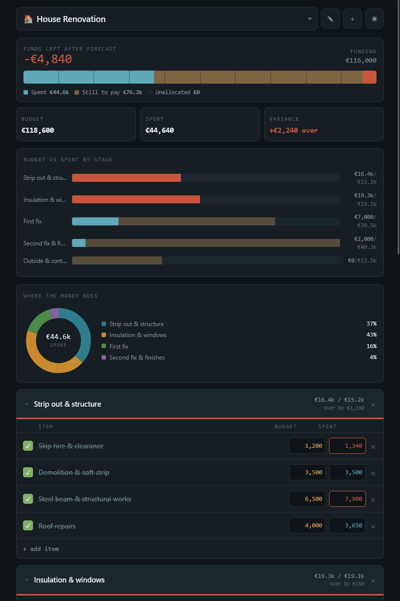
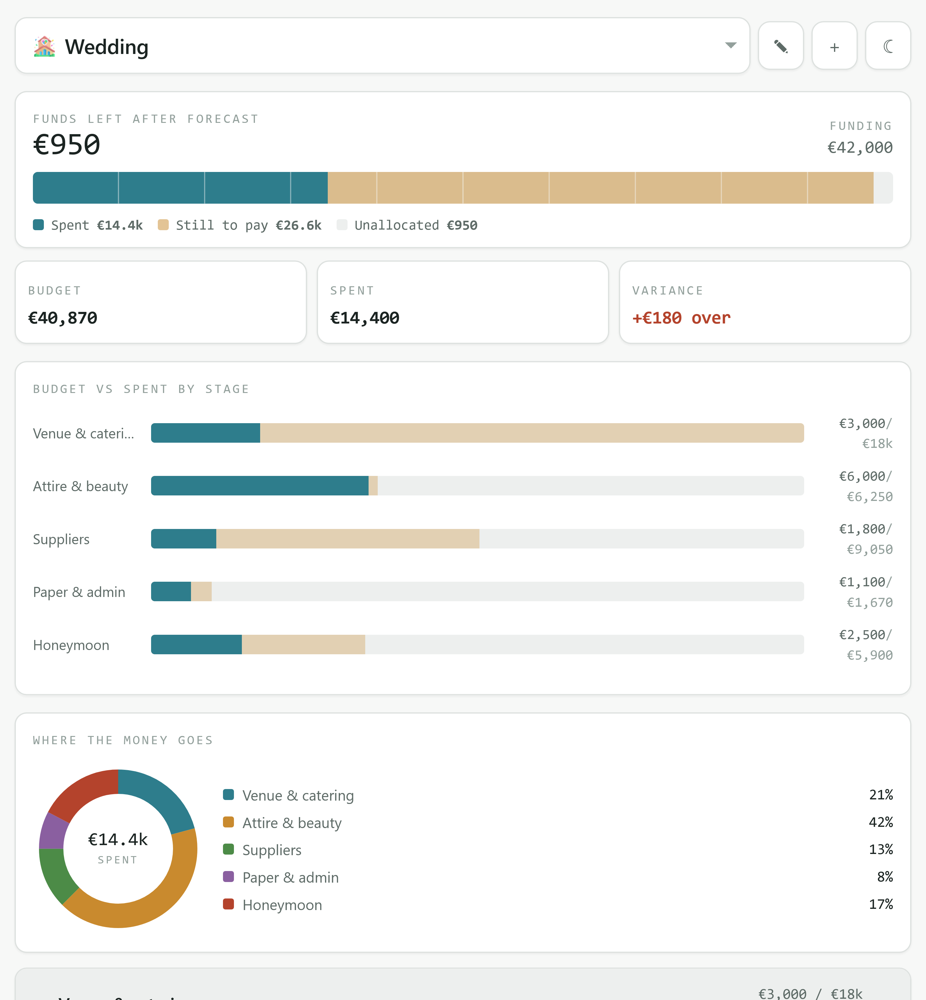
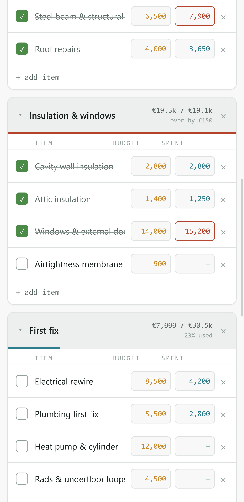

# Budget Tracker

A single-file budget tracker for projects with a lot of moving parts — a house build, a renovation, a wedding, a business fit-out. Plan what each line item should cost, log what it actually cost, and see how far ahead or behind you are.

No build step, no dependencies, no account. One HTML file that runs offline and stores everything in your browser.


---

## Screenshots

| Light | Dark |
| --- | --- |
|  |  |

| Charts | Mobile |
| --- | --- |
|  |  |

---

## Quick start

Download `index.html` and open it. That's it.

To try it with data first:

1. Open `index.html`
2. Click **import json**
3. Pick `examples/demo-data.json`

That loads two worked examples — a house renovation running slightly over budget, and a wedding just about staying under. Switch between them with the dropdown at the top.

To host it, drop `index.html` on any static host or GitHub Pages. There is no server side.

---

## What it does

**Multiple projects.** One file holds as many as you want. Switch with the dropdown, `+` to add, `✎` to rename.

**Budget vs actual per line.** Every item has a planned figure and a real one. The variance rolls up per stage and across the whole project.

**Forecast, not just totals.** Unticked items forecast at whichever is higher — budget or spend so far. Tick an item off and it forecasts at what you actually paid. So the headline number is "what this will cost me if nothing else changes", which is the number that matters when you're deciding whether you can afford the good tiles.

**Funding sources.** List the mortgage, the loan, the savings, the grant, whatever's paying. The bar at the top shows spent / still to pay / unallocated against that total, and turns red when the forecast passes what you have.

**Charts.** Horizontal budget-vs-spent bars per stage, and a donut showing where the money has actually gone so far. Both are hand-rolled SVG — no chart library.

**Forgiving number entry.** `18k`, `18,000`, `€18 000` and `18000` all parse the same. Handy on a phone.

**Light and dark.** Light by default, toggle top-right, choice is remembered.

**Your data stays yours.** Everything lives in `localStorage` on your device. Export JSON for a backup or to move between machines; export CSV to send to an accountant, a quantity surveyor, or a spreadsheet.

---

## Data format

Export produces the whole file. A single project looks like this:

```json
{
  "v": 2,
  "active": "p-wedding",
  "projects": [
    {
      "id": "p-wedding",
      "name": "Wedding",
      "currency": "€",
      "funding": [
        { "id": "w-savings", "name": "Joint savings", "amount": 30000 }
      ],
      "sections": [
        {
          "id": "s-venue",
          "name": "Venue & catering",
          "open": true,
          "items": [
            { "id": "w-deposit", "name": "Venue deposit", "budget": 3000, "actual": 3000, "done": true }
          ]
        }
      ]
    }
  ]
}
```

| Field | Notes |
| --- | --- |
| `v` | Format version. Currently `2`. |
| `active` | `id` of the project shown on load. |
| `projects[].name` | Shown in the dropdown and used for the CSV filename. |
| `projects[].currency` | Any symbol — `€`, `£`, `$`, `zł`. Display only, no conversion. |
| `funding[].amount` | Whole units, no decimals. |
| `sections[].open` | Whether the stage starts expanded. |
| `items[].budget` | Planned cost. |
| `items[].actual` | Spent so far. |
| `items[].done` | Ticked items forecast at `actual` instead of `budget`. |

All `id` values just need to be unique within the file. Readable ones like `s-venue` are fine — hand-editing the JSON in a text editor is often faster than tapping figures in on a phone.

Import accepts either shape: the full multi-project file above, or a bare `{ "name": ..., "sections": [...] }` object, which gets wrapped as a single project. When you already have projects loaded, import asks whether to add the incoming ones or replace everything.

---

## Examples

| File | What it is |
| --- | --- |
| `examples/demo-data.json` | Two full worked projects — house renovation and wedding. Good starting point for a look around. |
| `examples/house-build.json` | A new-build skeleton: site works, main contract, finishing, last-priority items. Budgets filled in, spend left at zero. |

---

## Browser support

Any current version of Firefox, Chrome, Safari or Edge, desktop or mobile. Uses `localStorage`, so it won't hold data in a private window or with site storage blocked.

---

## Notes and limits

- Storage is per browser, per device. Nothing syncs. Export before clearing browser data or switching phones.
- Amounts are whole units. No cents, no currency conversion.
- No undo. Deleting a stage or project asks first, then it's gone.

---

## Licence

MIT — see [LICENSE](LICENSE).
